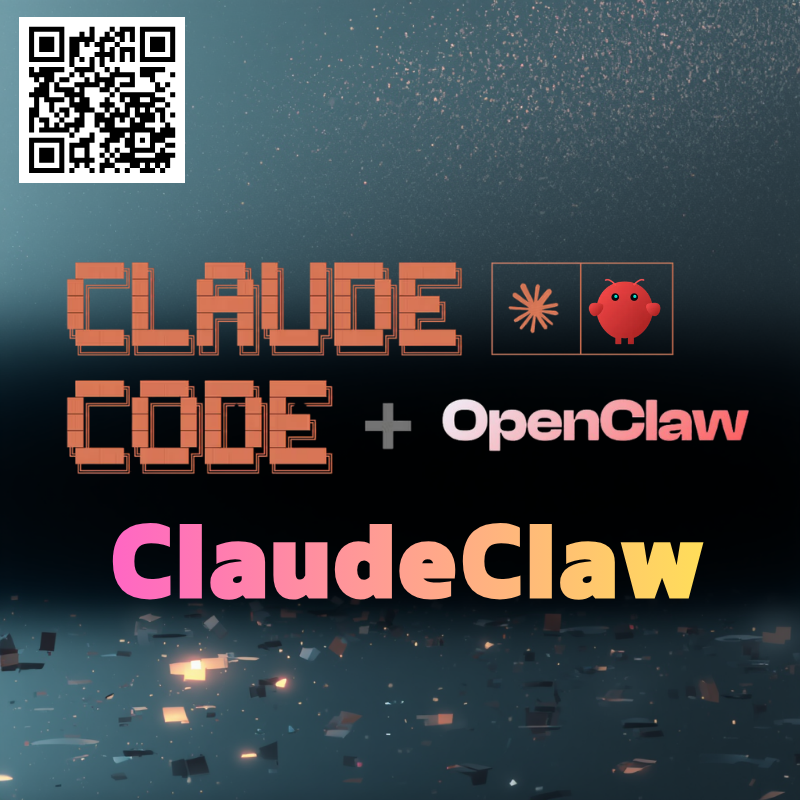

<table>
	<thead>
    	<tr>
      		<th style="text-align:center"><a href="./README.md">English</a></th>
      		<th style="text-align:center">한국어</th>
    	</tr>
  	</thead>
</table>

# 🦀ClaudeClaw — An OpenClaw-style personal AI assistant powered by Claude Code.

`claude-agent-sdk`를 사용한 상주형 AI 에이전트 시스템으로 Claude Code의 `settings.json`을 기반으로 동작합니다.
이 프로젝트는 [OpenClaw](https://github.com/openclaw/openclaw)을 영향을 받은 프로젝트입니다.
Unix 소켓 서버로 상주하며, CLI·REST API로 메시지를 수신하여 Claude에 프록시합니다.


---

## 기능 목록

| 기능                               | 명령어 / 엔드포인트                                         |
| ---------------------------------- | ----------------------------------------------------------- |
| 데몬 시작·중지·재시작·상태 확인    | `claudeclaw start/stop/restart/status`                      |
| 메시지 전송(스트리밍)              | `claudeclaw -m "메시지"`                                    |
| stdin / 파이프 입력                | `echo "질문" \| claudeclaw`                                 |
| 로그 표시                          | `claudeclaw logs [--tail N]`                                |
| 세션 관리                          | `claudeclaw sessions`                                       |
| Cron 작업 관리                     | `claudeclaw cron add/list/delete/run/edit`                  |
| HTTP REST API                      | `POST /message`, `POST /message/stream`, `GET /status` 등  |
| Cron REST API                      | `GET /cron`, `POST /cron`, `PATCH /cron/{id}`, `DELETE /cron/{id}` 등 |
| Discord 연동                       | 데몬 시작 시 자동 연결(`claudeclaw config set`으로 설정)    |
| Slack 연동                         | 데몬 시작 시 자동 연결(`claudeclaw config set`으로 설정)    |
| Heartbeat                          | `claudeclaw config set heartbeat.every 30m`으로 정기 폴링  |

---

## 설정

### 전제 조건

- Linux/Windows(WSL2)
- Python >= 3.14
- [claude-agent-sdk를 사용할 수 있는 환경](https://platform.claude.com/docs/ko/agent-sdk/overview)

### 의존 라이브러리

| 패키지                     | 용도                           |
| -------------------------- | ------------------------------ |
| `claude-agent-sdk>=0.1.48` | Claude AI 에이전트 SDK         |
| `fastapi>=0.115.0`         | REST API 프레임워크            |
| `uvicorn>=0.30.0`          | ASGI 서버                      |
| `apscheduler>=3.10,<4`     | Cron 작업 스케줄러(v3.x)      |
| `discord.py>=2.3`          | Discord Bot(선택 사항)         |
| `slack-bolt>=1.18`         | Slack Bot(선택 사항)           |

### 설치

```bash
git clone <repository-url> ~/.claudeclaw
cd ~/.claudeclaw
pip install -r requirements.txt

# PATH에 추가(~/.bashrc에 추가)
echo '[ -d "$HOME/.claudeclaw" ] && export PATH="$HOME/.claudeclaw:$PATH"' >> ~/.bashrc

# 탭 자동완성 활성화(~/.bashrc에 추가)
echo 'eval "$(register-python-argcomplete claudeclaw)"' >> ~/.bashrc

source ~/.bashrc
```

> **주의:** 프로젝트는 반드시 `~/.claudeclaw/`에 배치하세요.
> `src/config.py`가 `Path.home() / ".claudeclaw"`를 기본 경로로 사용하므로 다른 디렉토리에서는 동작하지 않습니다.

---

## 사용법

### 데몬 관리

```bash
# 시작(기본 포트: 28789)
claudeclaw start

# 포트를 지정하여 시작
claudeclaw start --port 18789

# 중지
claudeclaw stop

# 재시작
claudeclaw restart

# 상태 확인
claudeclaw status

# 로그 표시
claudeclaw logs           # 전체 내용
claudeclaw logs --tail 50 # 마지막 50줄
```

### 메시지 전송

```bash
# 간단한 전송
claudeclaw -m "프롬프트"

# 세션을 지정
claudeclaw --session-id work -m "프롬프트"

# stdin / 파이프
echo "질문" | claudeclaw
cat report.txt | claudeclaw -m "이것을 요약해줘"
git diff | claudeclaw -m "이 diff를 리뷰해줘"
```

### 세션 관리

```bash
# 목록 표시
claudeclaw sessions

# 전체 세션 삭제
claudeclaw sessions cleanup

# 특정 세션 삭제
claudeclaw sessions delete <session-id>
```

### Cron 작업

```bash
# 작업 추가(매일 아침 9시에 실행)
claudeclaw cron add "0 9 * * *" --name "morning" --session main -m "오늘의 할 일을 정리해줘"

# 목록 표시
claudeclaw cron list

# 수동 실행
claudeclaw cron run <job-id>

# 작업 편집(필드를 개별적으로 변경 가능)
claudeclaw cron edit <job-id> --name "새로운 이름"
claudeclaw cron edit <job-id> --schedule "0 10 * * *" --message "업데이트된 프롬프트"
claudeclaw cron edit <job-id> --session work
claudeclaw cron edit <job-id> --disable
claudeclaw cron edit <job-id> --enable

# 삭제
claudeclaw cron delete <job-id>
```

### Heartbeat

메인 세션에서 정기적으로 에이전트 턴을 실행하여 `~/.claudeclaw/HEARTBEAT.md`의 체크리스트를 처리합니다.
Cron과 달리, 메인 세션의 대화 컨텍스트를 유지한 채 실행됩니다.
에이전트가 `HEARTBEAT_OK`만 반환한 경우 알림을 억제하고 로그에만 기록합니다.

**설정:**

```bash
# Heartbeat 활성화(30분 간격)
claudeclaw config set heartbeat.every 30m

# Heartbeat 비활성화
claudeclaw config set heartbeat.every 0m

# 간격 설정을 유지한 채 일시 정지
claudeclaw config set heartbeat.disabled true

# 활성 시간대 설정(09:00~22:00 사이에만 실행)
claudeclaw config set heartbeat.active_hours.start "09:00"
claudeclaw config set heartbeat.active_hours.end "22:00"

# 데몬을 재시작하여 반영
claudeclaw restart
```

**HEARTBEAT.md:**

`~/.claudeclaw/HEARTBEAT.md`에 에이전트에게 전달할 체크리스트를 작성합니다.

```markdown
# Heartbeat 체크리스트

- 긴급한 미완료 작업이 있으면 확인해줘
- 아무것도 없으면 HEARTBEAT_OK만 반환해줘
```

> **주의:** `HEARTBEAT.md`가 존재하지 않는 경우 기본 프롬프트만으로 실행됩니다.
> 헤더 행이나 빈 줄만 있는 파일은 "실질적으로 비어있음"으로 간주하여 API 호출 절약을 위해 건너뜁니다.

**동작 확인:**

아래 로그가 출력되면 정상적으로 시작된 것입니다.

```
Heartbeat scheduler started (interval=1800s)
HEARTBEAT_OK (suppressed)
```

에이전트가 보고할 내용을 반환한 경우 `Heartbeat alert (len=N)`가 로그에 출력됩니다.

### Discord 연동

Discord Bot을 연결하여 지정 채널의 메시지를 수신·답장할 수 있습니다.

**전제 조건:**

1. [Discord Developer Portal](https://discord.com/developers/applications)에서 앱을 생성하고 Bot Token을 발급
2. Bot 설정에서 **Message Content Intent**를 활성화
3. OAuth2 URL로 서버에 Bot 초대

**설정:**

```bash
# Bot Token 설정(필수)
claudeclaw config set discord.bot_token <YOUR_BOT_TOKEN>

# 대상 채널 ID 설정(필수 — 채널 우클릭 → 채널 ID 복사)
claudeclaw config set discord.channel_id <YOUR_CHANNEL_ID>

# 사용할 세션 변경(기본값: "discord")
claudeclaw config set discord.session_id discord2

# 데몬을 재시작하여 반영
claudeclaw restart
```

> **주의:** `discord.channel_id`가 설정되지 않은 경우 Bot이 시작되지 않습니다(WARNING 로그가 출력됩니다).
> Token은 환경 변수 `DISCORD_BOT_TOKEN`으로도 설정할 수 있습니다.

**동작 확인:**

아래 로그가 출력되면 정상적으로 시작된 것입니다.

```
Discord bot starting (channel_id=..., session=...)
Discord bot ready (logged in as <BotName>)
```

시작 후, 설정한 채널에 전송된 메시지가 Claude에 전달되고 Bot이 답장합니다.

### Slack 연동

Slack Bot을 연결하여 DM·채널 멘션을 Socket Mode로 수신·답장할 수 있습니다.

**전제 조건:**

1. [Slack API Portal](https://api.slack.com/apps)에서 앱을 생성하고 워크스페이스에 설치
2. **Socket Mode**를 활성화하고 `connections:write` 스코프를 가진 App-Level Token(`xapp-`로 시작)을 발급
3. Bot Token Scopes에 `chat:write`, `reactions:write`, `channels:history`, `im:history`, `app_mentions:read` 추가
4. **Event Subscriptions**를 활성화하고 `message.im`과 `app_mention` 봇 이벤트를 구독
5. **Install App** 화면에서 Bot Token(`xoxb-`로 시작)을 발급

**설정:**

```bash
# Bot Token 설정(필수, xoxb-로 시작)
claudeclaw config set slack.bot_token <YOUR_BOT_TOKEN>

# App Token 설정(필수, xapp-로 시작)
claudeclaw config set slack.app_token <YOUR_APP_TOKEN>

# 사용할 세션 변경(기본값: "slack")
claudeclaw config set slack.session_id slack2

# 데몬을 재시작하여 반영
claudeclaw restart
```

> **주의:** `slack.bot_token`과 `slack.app_token` 모두 설정된 경우에만 Bot이 시작됩니다.
> Token은 환경 변수 `SLACK_BOT_TOKEN` / `SLACK_APP_TOKEN`으로도 설정할 수 있습니다.

**상세 옵션:**

```bash
# DM을 특정 사용자로 제한(기본값: "open" — 전체 허용)
claudeclaw config set slack.dm_policy allowlist
claudeclaw config set slack.allow_from '["U01234567", "U09876543"]'

# 채널 멘션을 특정 채널로 제한(기본값: "open" — 전체 채널 허용)
claudeclaw config set slack.channel_policy allowlist
claudeclaw config set slack.channels '["C01234567"]'
```

**동작 확인:**

아래 로그가 출력되면 정상적으로 시작된 것입니다.

```
Slack bot starting (session=...)
Slack bot ready (logged in as <BotName>, team=<TeamName>)
```

시작 후, Bot에 대한 DM 및 채널에서의 `@멘션`이 Claude에 전달되고 Bot이 답장합니다.

### systemd 연동(설정된 경우)

```bash
systemctl --user start claudeclaw
systemctl --user stop claudeclaw
systemctl --user status claudeclaw
```

---

## REST API

데몬 시작 후, 기본적으로 `http://localhost:28789`에서 접근할 수 있습니다.

| 메서드   | 경로              | 설명                             |
| -------- | ----------------- | -------------------------------- |
| `POST`   | `/message`        | 메시지 전송(전체 응답)           |
| `POST`   | `/message/stream` | 메시지 전송(SSE 스트리밍)        |
| `GET`    | `/status`         | 데몬 상태 및 PID                 |
| `GET`    | `/sessions`       | 세션 목록                        |
| `DELETE` | `/sessions`       | 전체 세션 삭제                   |
| `DELETE` | `/sessions/{id}`  | 지정 세션 삭제                   |
| `GET`    | `/cron`           | Cron 작업 목록                   |
| `POST`   | `/cron`           | Cron 작업 추가                   |
| `PATCH`  | `/cron/{id}`      | Cron 작업 편집                   |
| `DELETE` | `/cron/{id}`      | Cron 작업 삭제                   |
| `POST`   | `/cron/{id}/run`  | Cron 작업 수동 실행              |

> [!WARNING]
> 이 리포지토리는 개발 중입니다. 소스코드와 문서가 아직 완성되지 않았습니다.
